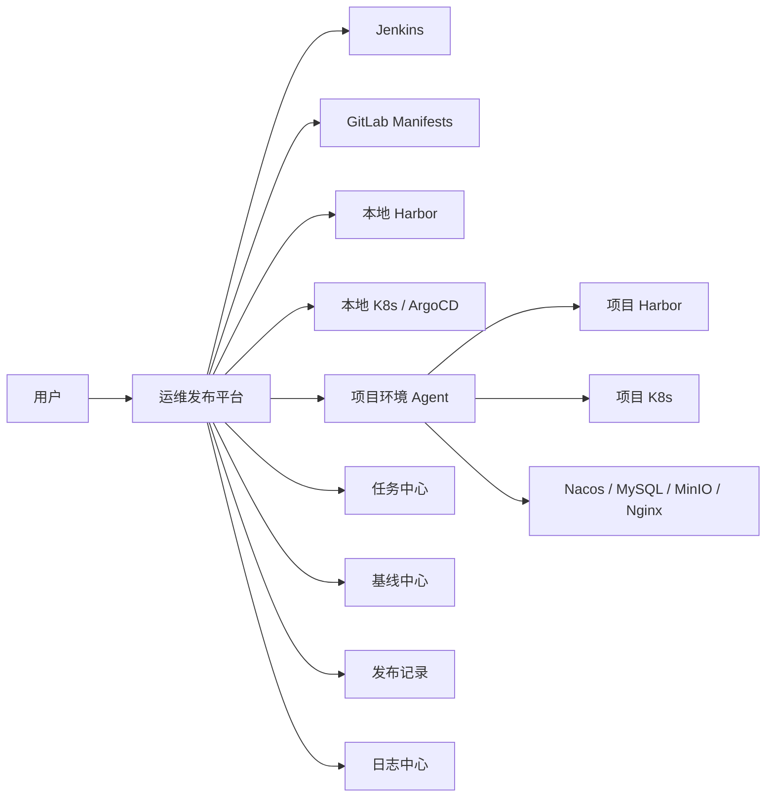

# 运维发布交付平台 PRD

## 1. 项目背景

当前产品和项目环境的部署、发版存在明显复杂度。

网络访问方面：

- 本地环境：登录 VPN 后，可以直接访问服务器和部署服务。
- 项目环境：复杂时需要经过 VPN、堡垒机、跳板机，才能访问服务器和服务。
- 多数项目环境不能被平台直接访问，只能由项目环境单向访问本地环境或中心服务。

发版方面：

- 服务数量多，部分产品包含 200+ 服务。
- 各模块经常独立发版，产品整体版本不可控。
- 产品和研发很难维护一个准确的 `v1.0.0`、`v1.0.1` 这种标准产品版本。
- 实际交付通常是“基于某个已经运行的环境”，例如本地生产环境当前状态。

现有本地环境发版流程：

```text
Jenkins + shell 脚本
-> 编译 dist/jar
-> 制作镜像
-> 推送 Harbor
-> 修改 GitLab manifests yaml
-> ArgoCD 每三分钟同步
-> 完成发版
```

现有项目环境发版流程：

```text
Jenkins + shell 脚本
-> 编译 dist/jar
-> 制作镜像
-> 推送 Harbor
-> 手动在项目 Harbor 查询镜像
-> 手动在项目 master / KubeSphere 修改 tag
-> 完成发版
```

现有产品部署流程：

- 依赖大量 shell 脚本。
- 需要处理 K8s、中间件、数据库、MinIO、Nacos、Nginx、manifests 等。
- 需要备份、修改、上传 OSS、下载、恢复、按顺序启动服务。
- 不同产品、不同项目环境差异大，脚本难维护。
- 失败后排查依赖个人经验，过程不可视、不可追踪。

## 2. 核心问题

### 2.1 产品无法标准化定版

当前不适合强行要求产品维护标准版本，例如：

```text
产品 A v1.0.0
产品 A v1.0.1
产品 A v1.1.0
```

原因：

- 服务太多。
- 模块频繁独立发版。
- 产品、研发无法维护完整准确的版本清单。
- 实际交付更多依赖某个环境的当前运行状态。

因此平台不能以“产品版本”为核心模型，而应该以“环境基线”为核心模型。

### 2.2 项目环境自动化不足

项目环境发布中存在大量人工步骤：

- 手动查 Harbor 镜像。
- 手动修改 KubeSphere 或 master 上的 workload tag。
- 手动确认服务是否启动成功。
- 手动记录发版内容。

这些动作容易出错，也难以审计。

### 2.3 部署脚本难维护

部署脚本承担了过多职责：

- 部署中间件。
- 导入数据库。
- 恢复 MinIO。
- 修改 manifests。
- 修改 Nacos。
- 修改 Nginx。
- 启动服务。
- 检查状态。

脚本越积越多，缺少统一参数、状态、日志、重试机制。

### 2.4 网络环境复杂

本地环境通常可以直接访问。

项目环境经常存在以下限制：

- 平台无法直接访问项目 K8s。
- 平台无法直接访问项目 Harbor。
- 平台无法直接访问项目服务器。
- 项目环境可能只能主动访问本地环境或中心平台。

因此平台必须支持 Agent 模式，由项目环境主动拉取任务并执行。

## 3. 产品定位

建设一个“环境基线驱动的运维发布交付平台”。

平台不强依赖产品、研发提前定义标准产品版本，而是从真实运行环境中自动采集当前状态，生成可追踪、可对比、可交付的环境基线。

平台核心定位：

```text
以真实运行环境为可信来源，
自动采集环境运行态，
生成环境基线，
对比目标环境差异，
自动同步镜像和配置，
执行发布或部署，
记录全过程日志和审计。
```

## 4. 产品目标

### 4.1 业务目标

1. 降低项目环境发版人工操作。
2. 降低每个项目重复编写 Jenkins 流水线和 shell 脚本的成本。
3. 支持从本地生产环境生成交付基线。
4. 支持项目环境基于基线进行差异发布。
5. 支持项目环境通过 Agent 完成自动发版。
6. 将部署脚本平台化，提升可视化、可追踪、可重试能力。

### 4.2 第一版目标

第一版不追求替换所有工具，而是打通最关键闭环：

```text
来源环境采集
-> 生成环境基线
-> 对比目标环境
-> 同步镜像
-> 更新服务 tag
-> 健康检查
-> 记录发布结果
```

第一版重点解决：

- 项目环境手动改 tag。
- 项目环境手动查镜像。
- 服务太多导致版本不可控。
- 无法从本地生产环境快速生成交付状态。
- 部署脚本执行过程不可视。

## 5. 用户角色

| 角色 | 主要诉求 |
|---|---|
| 运维人员 | 创建基线、执行部署、执行发布、查看日志、失败重试 |
| 研发人员 | 触发服务构建、查看镜像、提交发布服务 |
| 项目交付人员 | 将本地环境状态交付到项目环境 |
| 产品人员 | 查看项目环境交付状态，但不负责维护完整版本 |
| 管理人员 | 查看各环境版本差异、发布记录、操作审计 |
| 平台管理员 | 管理环境、Agent、Harbor、Jenkins、GitLab、K8s 凭证 |

## 6. 核心概念

### 6.1 产品

产品只作为服务分组，不强制维护标准产品版本。

示例：

```text
产品 A
- user-service
- order-service
- gateway-service
- web-console
```

### 6.2 服务

服务是最小发版单位。

服务信息包括：

- 服务名称
- 所属产品
- namespace
- workload 名称
- workload 类型
- 镜像仓库地址
- 健康检查地址
- 启动顺序，可选
- 依赖服务，可选

### 6.3 环境

环境是运行产品和服务的目标。

环境类型：

| 类型 | 说明 |
|---|---|
| 本地环境 | 登录 VPN 后可直接访问 |
| 项目环境 | 可能需要堡垒机、跳板机，建议通过 Agent 接入 |
| 测试环境 | 可选 |
| 预发环境 | 可选 |

环境信息包括：

- 环境名称
- 环境类型
- K8s 集群信息
- Harbor 地址
- GitLab manifests 地址
- Jenkins 地址
- ArgoCD 地址
- Nacos 地址
- MySQL 信息
- MinIO 信息
- Nginx 信息
- Agent 状态
- 网络访问模式

### 6.4 环境基线

环境基线是某个环境在某个时间点的运行状态快照。

它替代传统意义上的“产品版本”。

基线示例：

```text
基线 ID：BL-20260607-0001
基线名称：local-prod-20260607-1530
来源环境：本地生产环境
产品：产品 A
服务数量：213
创建时间：2026-06-07 15:30
创建人：张三
状态：已锁定
用途：项目 X 交付
```

基线内容包括：

- 服务清单
- 每个服务当前镜像 tag
- 镜像 digest
- namespace
- workload 名称
- workload 类型
- 副本数
- manifests commit，可选
- Nacos 配置快照，可选
- Nginx 配置快照，可选
- MySQL 备份引用，可选
- MinIO 备份引用，可选

### 6.5 发布单

发布单用于记录一次发版操作。

发布单可以来自：

- 单服务发版
- 多服务批量发版
- 基线差异发布
- 回滚发布

### 6.6 部署任务

部署任务用于执行产品初始化、组件部署、数据恢复、服务启动等流程。

部署任务可以基于：

- 环境基线
- 部署包
- 现有 shell 脚本
- 平台标准步骤

## 7. 总体架构



### 7.1 平台服务端

职责：

- 管理产品、服务、环境。
- 采集本地环境运行态。
- 生成环境基线。
- 创建发布任务。
- 创建部署任务。
- 调用 Jenkins、Harbor、GitLab、ArgoCD。
- 接收 Agent 心跳、日志、执行结果。
- 记录发布和部署审计。

### 7.2 项目环境 Agent

Agent 部署在项目环境内。

职责：

- 主动连接平台。
- 拉取发布任务。
- 拉取部署任务。
- 同步镜像。
- 调用项目 Harbor。
- 执行 kubectl / helm / shell。
- 更新服务镜像 tag。
- 执行健康检查。
- 回传日志和状态。

Agent 是解决项目环境网络不可达问题的核心。

## 8. 核心流程

### 8.1 本地环境日常发版流程

```text
选择产品和服务
选择代码分支
触发 Jenkins 构建
构建 dist/jar
制作镜像
推送本地 Harbor
记录镜像 tag
更新 GitLab manifests
触发 ArgoCD 同步或等待自动同步
检查服务状态
记录发布结果
```

### 8.2 项目环境日常发版流程

```text
选择产品、项目环境、服务
选择目标镜像 tag
创建发布单
项目 Agent 拉取任务
Agent 同步镜像到项目 Harbor
Agent 更新 K8s workload image
Agent 等待 rollout 完成
Agent 执行健康检查
平台展示结果
记录发布历史
```

### 8.3 基于环境基线的项目交付流程

```text
选择来源环境，例如本地生产环境
平台采集当前服务运行态
生成环境基线
锁定基线
选择目标项目环境
平台对比基线和目标环境
生成差异报告
确认发布范围
Agent 同步缺失镜像
Agent 更新目标环境服务 tag
执行健康检查
生成交付记录
```

### 8.4 产品部署流程

```text
选择产品
选择来源基线或部署包
选择目标环境
配置环境参数
执行部署步骤
查看每一步日志
失败后重试或跳过
完成健康检查
记录部署结果
```

部署步骤示例：

```text
1. 检查环境连接
2. 检查 Harbor
3. 检查 K8s namespace
4. 部署中间件
5. 恢复 MySQL
6. 恢复 MinIO
7. 应用 manifests
8. 写入 Nacos 配置
9. 写入 Nginx 配置
10. 执行初始化 SQL
11. 启动服务
12. 健康检查
```

## 9. 功能需求

## 9.1 产品与服务管理

### 功能说明

用于管理产品和服务基础信息。

### 主要功能

- 创建产品。
- 编辑产品。
- 删除产品，需校验是否有关联环境和发布记录。
- 维护服务清单。
- 支持从 K8s 自动发现服务。
- 支持从 manifests 导入服务。
- 支持批量导入服务。
- 维护服务镜像仓库。
- 维护服务健康检查规则。
- 维护服务所属 namespace。
- 维护 workload 名称和类型。

### V1 要求

V1 不要求人工完整维护所有服务清单，必须支持从环境自动采集。

V1 服务字段：

| 字段 | 必填 | 说明 |
|---|---|---|
| 产品 | 是 | 服务所属产品 |
| 服务名 | 是 | 平台展示名称 |
| namespace | 是 | K8s namespace |
| workload 名称 | 是 | Deployment / StatefulSet 名称 |
| workload 类型 | 是 | Deployment / StatefulSet |
| 镜像地址 | 是 | 当前镜像 |
| 健康检查 | 否 | 可选 |

## 9.2 环境管理

### 功能说明

管理本地环境、项目环境及相关集成配置。

### 主要功能

- 创建环境。
- 编辑环境。
- 配置环境类型。
- 配置网络访问模式。
- 配置 Harbor。
- 配置 K8s。
- 配置 Jenkins。
- 配置 GitLab。
- 配置 ArgoCD。
- 配置 Nacos。
- 配置 MySQL。
- 配置 MinIO。
- 配置 Nginx。
- 管理环境凭证。
- 测试连接。
- 查看 Agent 在线状态。

### 网络模式

| 模式 | 说明 |
|---|---|
| 平台直连 | 平台可直接访问目标环境 |
| Agent 模式 | 目标环境 Agent 主动访问平台 |
| 离线模式 | 后续支持，生成离线包手动导入 |

### V1 要求

必须支持：

- 本地环境直连。
- 项目环境 Agent 模式。
- Harbor 连接测试。
- K8s 连接测试。
- Agent 心跳状态。

## 9.3 Agent 管理

### 功能说明

用于管理项目环境 Agent。

### 主要功能

- 注册 Agent。
- 绑定环境。
- 查看 Agent 在线状态。
- 查看 Agent 版本。
- 查看 Agent 最近心跳时间。
- 查看 Agent 可执行能力。
- 下发任务。
- 接收日志。
- 接收任务结果。

### Agent 执行能力

V1 Agent 至少支持：

- 拉取任务。
- 同步镜像。
- 执行 kubectl。
- 执行 shell 脚本。
- 查询 Pod 状态。
- 查询 Deployment / StatefulSet。
- 更新 workload 镜像。
- 执行 HTTP 健康检查。
- 回传日志。

## 9.4 环境运行态采集

### 功能说明

从环境中自动采集当前真实运行状态。

### 采集内容

V1 采集：

- namespace
- workload 名称
- workload 类型
- 当前 image
- 当前 tag
- image digest，可选
- 副本数
- ready 副本数
- rollout 状态
- Pod 状态
- 服务更新时间

后续采集：

- Nacos 配置。
- Nginx 配置。
- ConfigMap。
- Secret 元数据。
- manifests commit。
- 数据库结构。
- 中间件版本。

### 采集方式

本地环境：

```text
平台直连 K8s API 或 ArgoCD
```

项目环境：

```text
Agent 查询项目 K8s 后回传
```

## 9.5 环境基线管理

### 功能说明

基于某个环境当前运行态生成环境基线。

### 主要功能

- 从环境生成基线。
- 查看基线服务清单。
- 查看基线镜像 tag。
- 查看基线来源环境。
- 给基线添加名称、备注、用途。
- 锁定基线。
- 复制基线。
- 基线用于发布。
- 基线用于交付。
- 基线用于回滚参考。

### 基线状态

| 状态 | 说明 |
|---|---|
| 草稿 | 已生成，可调整备注 |
| 已锁定 | 用于正式交付，不允许修改 |
| 已废弃 | 不再推荐使用 |

### V1 要求

V1 必须支持：

- 从本地生产环境生成基线。
- 从项目环境生成基线。
- 基线锁定。
- 基线服务镜像清单查看。
- 基线导出为清单文件，可选。

## 9.6 环境差异对比

### 功能说明

对比来源基线和目标环境之间的差异。

### V1 对比范围

V1 重点对比服务镜像。

对比字段：

- 服务是否存在。
- namespace 是否一致。
- workload 是否存在。
- 镜像仓库是否一致。
- tag 是否一致。
- digest 是否一致，可选。

### 差异结果

| 差异类型 | 处理策略 |
|---|---|
| 目标环境缺少服务 | 提示可新增部署 |
| tag 不一致 | 支持更新 |
| 来源不存在，目标存在 | 提示，不自动删除 |
| workload 不存在 | 提示异常 |
| namespace 不存在 | 提示需初始化 |

### 差异报告示例

| 服务 | 来源 tag | 目标 tag | 状态 |
|---|---|---|---|
| user-service | 20260607-a1b2c3 | 20260601-d4e5f6 | 需更新 |
| order-service | 20260606-111aaa | 20260606-111aaa | 一致 |
| web-console | 20260607-999bbb | 未部署 | 缺失 |

## 9.7 构建管理

### 功能说明

平台对接 Jenkins，作为统一构建入口。

### 主要功能

- 选择产品。
- 选择服务。
- 选择代码分支。
- 触发 Jenkins job。
- 传递构建参数。
- 查看构建状态。
- 查看构建日志链接。
- 记录构建生成的镜像 tag。

### V1 要求

V1 不重写 Jenkins。

平台只做：

- Jenkins job 配置管理。
- Jenkins 参数管理。
- Jenkins 触发。
- 构建结果回写。
- 镜像 tag 记录。

## 9.8 镜像管理

### 功能说明

管理服务镜像和镜像同步。

### 主要功能

- 查看服务镜像 tag。
- 查看镜像来源。
- 查看构建时间。
- 查看构建人。
- 查看镜像 digest。
- 同步镜像到项目 Harbor。
- 批量同步镜像。
- 检查目标 Harbor 是否存在镜像。

### V1 要求

必须支持：

- 单服务镜像同步。
- 多服务镜像同步。
- 基于基线批量同步镜像。
- 通过 Agent 同步到项目 Harbor。
- 同步失败重试。

## 9.9 发布管理

### 功能说明

支持单服务、多服务、基线差异发布。

### 发布类型

| 类型 | 说明 |
|---|---|
| 单服务发布 | 日常服务发版 |
| 多服务发布 | 批量服务发版 |
| 基线发布 | 将某个环境基线发布到目标环境 |
| 回滚发布 | 回滚到历史 tag，V1 简单支持 |

### 发布流程

```text
创建发布单
选择发布类型
选择目标环境
选择服务或来源基线
生成差异
确认发布范围
同步镜像
更新 tag
等待 rollout
健康检查
完成发布
```

### V1 要求

必须支持：

- 单服务发布。
- 多服务发布。
- 基线差异发布。
- 项目环境 Agent 发布。
- 发布日志查看。
- 发布失败重试。
- 发布结果记录。
- 简单回滚到上一个 tag。

## 9.10 部署管理

### 功能说明

将现有部署脚本纳入平台管理。

### V1 策略

V1 不强制重写所有 shell 脚本，而是先包装脚本。

平台负责：

- 参数管理。
- 步骤编排。
- 执行顺序。
- 日志采集。
- 状态记录。
- 失败重试。
- 人工确认。

### 部署步骤类型

V1 支持：

- shell 脚本步骤。
- kubectl apply 步骤。
- 镜像同步步骤。
- SQL 执行步骤，可选。
- HTTP 健康检查步骤。
- 人工确认步骤。

### 部署任务状态

| 状态 | 说明 |
|---|---|
| 待执行 | 已创建未开始 |
| 执行中 | 正在执行 |
| 等待确认 | 需要人工确认 |
| 失败 | 某步骤失败 |
| 已完成 | 全部步骤成功 |
| 已取消 | 人工取消 |

## 9.11 日志与审计

### 功能说明

记录发布、部署、构建、Agent 执行日志。

### 主要功能

- 查看发布日志。
- 查看部署步骤日志。
- 查看 Agent 执行日志。
- 查看操作人。
- 查看操作时间。
- 查看发布前后 tag。
- 查看失败原因。
- 下载日志，可选。

### V1 要求

必须记录：

- 谁执行。
- 在哪个环境执行。
- 对哪些服务执行。
- 从哪个 tag 到哪个 tag。
- 是否成功。
- 失败在哪一步。
- Agent 返回的日志。

## 9.12 权限管理

### 功能说明

控制用户可访问的产品、环境和操作。

### V1 角色

| 角色 | 权限 |
|---|---|
| 平台管理员 | 所有权限 |
| 运维人员 | 环境、发布、部署权限 |
| 研发人员 | 构建、查看镜像、申请发布 |
| 只读用户 | 查看基线、发布记录、环境状态 |

### V1 权限控制

- 用户登录。
- 角色管理。
- 环境权限。
- 发布权限。
- 部署权限。
- 操作审计。

## 10. 第一版必须做

V1 必须围绕“环境基线驱动的项目环境发版交付”建设。

| 模块 | 必须做 |
|---|---|
| 产品服务管理 | 产品分组、服务清单、服务自动采集 |
| 环境管理 | 本地环境、项目环境、Harbor、K8s、Agent |
| Agent | 项目环境拉取任务、执行发布、回传日志 |
| 运行态采集 | 采集 K8s workload 和当前镜像 tag |
| 环境基线 | 从环境生成基线、锁定基线、查看服务镜像清单 |
| 差异对比 | 对比基线和目标环境的服务镜像差异 |
| 镜像同步 | 从本地 Harbor 同步到项目 Harbor |
| 发布管理 | 单服务、多服务、基线差异发布 |
| 健康检查 | rollout 状态、Pod 状态、HTTP 检查 |
| 部署管理 | 包装现有 shell 脚本为平台步骤 |
| 日志审计 | 发布日志、部署日志、操作记录 |
| 权限 | 基础用户、角色、环境权限 |

## 11. 第一版先不做

| 功能 | 暂不做原因 |
|---|---|
| 强产品版本管理 | 当前不具备准确维护产品版本的条件 |
| 完整低代码编排器 | 成本高，V1 先包装脚本 |
| 全量替代 Jenkins | 现有 Jenkins 可复用 |
| 全量替代 ArgoCD | 本地环境已有成熟链路 |
| 全量替代 KubeSphere | 平台只负责发布动作和记录 |
| 完整配置中心 | Nacos 仍作为配置中心 |
| 复杂审批流 | V1 先做确认发布 |
| 灰度 / 金丝雀 | 依赖流量治理和服务治理 |
| 自动容量评估 | 依赖监控和历史数据 |
| 数据库结构自动对比 | 风险高，后续专项建设 |
| 自动删除目标环境多余服务 | 风险高，V1 只提示 |
| 完整离线交付 | 可作为 V2 |
| 多云资源管理 | 当前不是核心痛点 |

## 12. 关键页面

| 页面 | 说明 |
|---|---|
| 首页看板 | 环境状态、Agent 状态、最近发布、失败任务 |
| 产品列表 | 产品分组和服务数量 |
| 服务列表 | 服务、namespace、workload、当前镜像 |
| 环境列表 | 本地环境、项目环境、连接状态 |
| 环境详情 | 集群、Harbor、Agent、运行态 |
| 基线列表 | 所有环境基线 |
| 基线详情 | 基线服务清单、镜像 tag、来源环境 |
| 环境对比 | 来源基线和目标环境差异 |
| 创建发布单 | 选择服务或基线，选择目标环境 |
| 发布详情 | 镜像同步、更新 tag、健康检查、日志 |
| 部署任务列表 | 产品部署任务 |
| 部署详情 | 步骤状态、脚本日志、失败重试 |
| 镜像管理 | 服务镜像 tag、同步状态 |
| Agent 管理 | Agent 在线状态、版本、心跳 |
| 系统配置 | Jenkins、Harbor、GitLab、K8s、凭证 |
| 用户权限 | 用户、角色、环境权限 |

## 13. 数据模型草案

核心实体：

```text
Product
Service
Environment
EnvironmentAgent
RuntimeSnapshot
EnvironmentBaseline
BaselineServiceItem
ReleaseOrder
ReleaseTask
DeployTask
DeployStep
ImageVersion
Registry
Cluster
Credential
OperationLog
```

核心关系：

```text
Product 1 - N Service
Environment 1 - N RuntimeSnapshot
Environment 1 - N EnvironmentBaseline
EnvironmentBaseline 1 - N BaselineServiceItem
ReleaseOrder 1 - N ReleaseTask
DeployTask 1 - N DeployStep
Environment 1 - 1 EnvironmentAgent
Service 1 - N ImageVersion
```

## 14. 成功指标

| 指标 | V1 目标 |
|---|---|
| 项目环境单服务发版耗时 | 降低到 3-5 分钟 |
| 项目环境手工改 tag | 减少 80% 以上 |
| 项目环境发布记录 | 100% 可追踪 |
| 服务镜像差异识别 | 支持 200+ 服务批量对比 |
| 基线生成时间 | 200+ 服务在数分钟内完成 |
| 发布失败定位 | 能定位到具体步骤和服务 |
| 部署脚本可视化 | 核心部署流程纳入平台 |
| 镜像同步失败重试 | V1 支持 |
| 回滚到上一 tag | V1 支持简单回滚 |

## 15. 分阶段规划

### 第一期：环境基线与发布闭环

目标：解决项目环境无法一键发版的问题。

范围：

- 环境管理。
- Agent。
- K8s 运行态采集。
- 环境基线。
- 镜像差异对比。
- 镜像同步。
- 自动更新 tag。
- 健康检查。
- 发布记录。

### 第二期：部署脚本平台化

目标：降低部署脚本维护成本。

范围：

- 部署任务。
- 部署步骤。
- shell 步骤托管。
- 参数模板。
- 日志采集。
- 失败重试。
- 人工确认。
- SQL / Nacos / Nginx 标准步骤。

### 第三期：交付治理与标准化

目标：从“能自动化”走向“可治理”。

范围：

- 配置差异对比。
- manifests 差异对比。
- 基线包导出。
- 离线交付。
- 审批流。
- 环境巡检。
- 发布报告。
- 多项目版本矩阵。
- 灰度发布。

## 16. 结论

这版 PRD 的核心变化是：

```text
不以产品版本为中心，
而以环境基线为中心。
```

平台不要求产品和研发先定义准确的 `v1.0.0`，而是承认当前真实工作方式：

```text
基于某个已运行环境进行交付。
```

因此第一版最重要的能力是：

1. 从本地生产环境自动采集当前运行态。
2. 生成可信环境基线。
3. 对比项目环境差异。
4. 自动同步镜像。
5. 自动更新项目环境服务 tag。
6. 完成健康检查。
7. 留下完整发布记录。

这样既符合当前组织能力，也能把现有依赖经验和脚本的流程，逐步收敛到平台中。